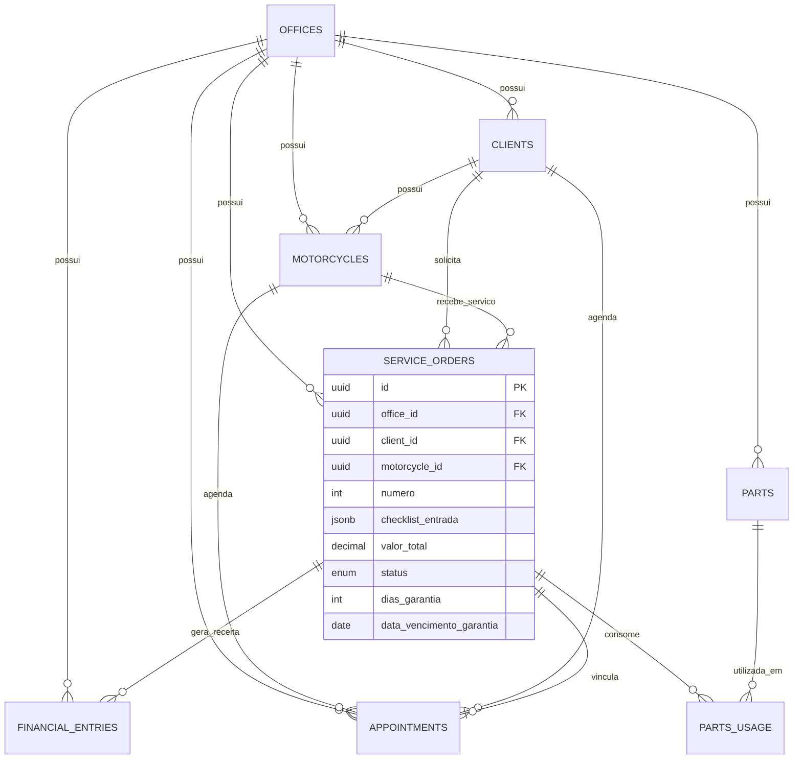

# Arquitetura de Dados — Craft Oficina

Documentação técnica do modelo de dados do **Craft**, preparado para evolução localStorage → **Supabase** e operação **SaaS multi-oficina**.

---

## Visão geral

```
┌─────────────────────────────────────────────────────────────┐
│                      Camada de UI (React)                    │
│  pages/ · components/ · context/CraftContext (estado React)  │
└─────────────────────────────┬───────────────────────────────┘
                              │
┌─────────────────────────────▼───────────────────────────────┐
│                   Camada de Serviços                         │
│  services/craft-data.service.ts    — CRUD e regras           │
│  services/ordem-servico.service.ts — OS, garantia, KM        │
│  services/analytics.service.ts     — dashboard e alertas     │
│  services/agendamento.service.ts   — vínculos agenda/OS      │
│  services/migration.service.ts     — timestamps e tenant     │
└─────────────────────────────┬───────────────────────────────┘
                              │
┌─────────────────────────────▼───────────────────────────────┐
│                   Camada de Repositório                      │
│  services/repository/local.repository.ts  (atual)            │
│  services/repository/supabase.repository.ts  (futuro)        │
└─────────────────────────────┬───────────────────────────────┘
                              │
┌─────────────────────────────▼───────────────────────────────┐
│                   Tipos centralizados                        │
│  src/types/ — entidades, enums, inputs, database             │
└─────────────────────────────────────────────────────────────┘
```

---

## Convenções de campos (Supabase-ready)

Todas as entidades persistentes seguem o padrão base:

| Campo Supabase | Alias legado (app) | Tipo | Descrição |
|----------------|-------------------|------|-----------|
| `id` | `id` | `uuid` / `string` | Chave primária |
| `office_id` | `oficina_id` | `uuid` | Tenant (oficina) |
| `created_at` | `criado_em` | `timestamptz` / `date` | Criação |
| `updated_at` | `atualizado_em` | `timestamptz` / `date` | Atualização |

> A migração automática (`database-migration.service.ts`) espelha os campos legados ao carregar/salvar, garantindo compatibilidade com dados existentes no localStorage.

Constante de tenant atual: `OFFICE_ID` (`oficina-craft-001`).

---

## Diagrama de relacionamentos



---

## Entidades

### 1. Oficina (`offices`)

**Tipo:** `Oficina` / `ConfiguracaoOficina` — `src/types/oficina.ts`

| Campo | PK/FK | Descrição |
|-------|-------|-----------|
| `id` | PK | Identificador da oficina |
| `office_id` | — | Espelha `id` (tenant root) |
| `oficina_id` | — | Alias legado |
| `nome` | | Nome comercial |
| `endereco` | | Endereço completo |
| `telefone` | | Contato |
| `cnpj` | | Opcional |
| `email` | | Opcional |
| `preferencias` | | JSON: tema, notificações, alertas |
| `created_at` / `updated_at` | | Timestamps |

**Relacionamentos:** 1:N com todas as demais entidades via `office_id`.

---

### 2. Clientes (`clients`)

**Tipo:** `Cliente` — `src/types/cliente.ts`

| Campo | PK/FK | Descrição |
|-------|-------|-----------|
| `id` | PK | UUID |
| `office_id` | FK → offices | Tenant |
| `nome` | | Nome completo |
| `telefone` | | Telefone |
| `cpf` | | Opcional |
| `endereco` | | Endereço |
| `observacoes` | | Notas |
| `created_at` | | Data cadastro |

**Relacionamentos:**
- 1:N → `Motos` (`cliente_id`)
- 1:N → `OrdensServico` (`cliente_id`)
- 1:N → `Agendamentos` (`cliente_id`)

---

### 3. Motos (`motorcycles`)

**Tipo:** `Moto` — `src/types/moto.ts`

| Campo | PK/FK | Descrição |
|-------|-------|-----------|
| `id` | PK | UUID |
| `office_id` | FK | Tenant |
| `cliente_id` | FK → clients | Proprietário |
| `marca`, `modelo`, `ano` | | Identificação |
| `placa` | | Placa (única por office) |
| `cor` | | Cor |
| `quilometragem` | | KM atual (atualizada na OS) |
| `chassi` | | Opcional |
| `observacoes` | | Opcional |

**Relacionamentos:**
- N:1 → `Cliente`
- 1:N → `OrdensServico`
- 1:N → `Agendamentos`

---

### 4. Ordens de Serviço (`service_orders`)

**Tipo:** `OrdemServico` — `src/types/ordem-servico.ts`

| Campo | PK/FK | Descrição |
|-------|-------|-----------|
| `id` | PK | UUID |
| `office_id` | FK | Tenant |
| `cliente_id` | FK | Cliente |
| `moto_id` | FK | Moto |
| `numero` | | Sequencial por office |
| `defeito_relatado` | | Relato do cliente |
| `diagnostico` | | Diagnóstico técnico |
| `servicos_executados` | | Texto / lista de serviços |
| `pecas_utilizadas` | | JSON array (`PecaUtilizada`) |
| `valor_pecas`, `valor_mao_obra`, `desconto` | | Financeiro |
| `valor_total` | | Calculado |
| `status` | | Enum `StatusOS` |
| `checklist_entrada` | | JSON (`ChecklistEntrada`) |
| `valor_estimado`, `data_orcamento`, `status_orcamento` | | Orçamento |
| `quilometragem_entrada`, `quilometragem_saida` | | KM |
| `dias_garantia`, `data_vencimento_garantia` | | Garantia |
| `created_at`, `updated_at` | | Timestamps |

**Status OS:** `recebida` · `em_diagnostico` · `aguardando_aprovacao` · `aguardando_peca` · `em_servico` · `finalizada` · `entregue` · `cancelada`

**Relacionamentos:**
- N:1 → Cliente, Moto
- 1:N → Lancamentos (receita)
- 1:1? → Agendamento (`ordem_servico_id`)

**Subestruturas JSON:**
- `checklist_entrada.itens[]` — `{ chave, ok, observacao? }`
- `pecas_utilizadas[]` — `{ peca_id, nome, quantidade, valor_unitario }`

---

### 5. Agenda (`appointments`)

**Tipo:** `Agendamento` — `src/types/agendamento.ts`

| Campo | PK/FK | Descrição |
|-------|-------|-----------|
| `id` | PK | UUID |
| `office_id` | FK | Tenant |
| `data`, `horario` | | Agendamento |
| `cliente_id` | FK | Cliente |
| `moto_id` | FK | Moto |
| `servico` | | Descrição |
| `status` | | Enum `StatusAgendamento` |
| `ordem_servico_id` | FK? | Vínculo opcional com OS |
| `observacoes` | | Opcional |

---

### 6. Estoque / Peças (`parts`)

**Tipo:** `Peca` — `src/types/peca.ts`

| Campo | PK/FK | Descrição |
|-------|-------|-----------|
| `id` | PK | UUID |
| `office_id` | FK | Tenant |
| `nome`, `codigo`, `marca` | | Identificação |
| `custo`, `preco_venda` | | Valores |
| `quantidade`, `estoque_minimo` | | Controle |

**Uso em OS:** embedado em `pecas_utilizadas` (desnormalizado). Futuro Supabase: tabela `service_order_parts` para normalização.

---

### 7. Financeiro (`financial_entries`)

**Tipo:** `LancamentoFinanceiro` — `src/types/financeiro.ts`

| Campo | PK/FK | Descrição |
|-------|-------|-----------|
| `id` | PK | UUID |
| `office_id` | FK | Tenant |
| `tipo` | | `receita` \| `despesa` |
| `descricao` | | Texto |
| `valor` | | Decimal |
| `forma_pagamento` | | Enum |
| `data` | | Data lançamento |
| `pago` | | Boolean |
| `vencimento` | | Contas a pagar/receber |
| `ordem_servico_id` | FK? | Vínculo OS |

---

### 8. Garantias (entidade lógica)

**Tipo:** `Garantia` — `src/types/ordem-servico.ts` (derivada)

Não possui tabela própria hoje. Campos em `service_orders`:
- `dias_garantia`
- `data_vencimento_garantia`

**Serviço:** `extrairGarantias()` em `ordem-servico.service.ts`

Futuro Supabase: tabela `warranties` com FK `service_order_id`.

---

### 9. Histórico de motos (visão derivada)

**Tipos:** `RegistroQuilometragem`, histórico via `OrdemServico[]`

Não persistido separadamente. Construído por:
- `obterHistoricoMoto(motoId, ordens)`
- `extrairRegistrosQuilometragem(ordens)`

Futuro Supabase: tabela `mileage_logs` ou view materializada.

---

## Metadados do banco local

**Tipo:** `CraftDatabase` — `src/types/database.ts`

```typescript
{
  clientes: Cliente[]
  motos: Moto[]
  ordens_servico: OrdemServico[]
  pecas: Peca[]
  lancamentos: LancamentoFinanceiro[]
  agendamentos: Agendamento[]
  configuracao: Oficina
  proximo_numero_os: number  // contador local; futuro: sequence por office
}
```

Chave localStorage: `craft_database_v1` (`STORAGE_KEY`).

---

## Mapeamento Supabase (proposta)

| Entidade app | Tabela Supabase | RLS |
|--------------|-----------------|-----|
| `Oficina` | `offices` | `office_id = auth.jwt()->office_id` |
| `Cliente` | `clients` | tenant + CRUD por role |
| `Moto` | `motorcycles` | tenant |
| `OrdemServico` | `service_orders` | tenant |
| `Peca` | `parts` | tenant |
| `LancamentoFinanceiro` | `financial_entries` | tenant |
| `Agendamento` | `appointments` | tenant |
| Checklist | `service_orders.checklist_entrada` (jsonb) | — |
| Peças na OS | `service_order_parts` | FK order + part |
| Garantia | `warranties` ou colunas na OS | tenant |

### Políticas RLS recomendadas

```sql
-- Exemplo: clients
CREATE POLICY "tenant_isolation" ON clients
  USING (office_id = (auth.jwt() ->> 'office_id')::uuid);
```

### Índices sugeridos

```sql
CREATE INDEX idx_clients_office ON clients(office_id);
CREATE INDEX idx_service_orders_office_status ON service_orders(office_id, status);
CREATE INDEX idx_service_orders_moto ON service_orders(moto_id);
CREATE INDEX idx_appointments_office_date ON appointments(office_id, data);
CREATE UNIQUE INDEX idx_motorcycles_plate_office ON motorcycles(office_id, placa);
```

---

## Camada de serviços

| Serviço | Responsabilidade |
|---------|------------------|
| `CraftDataService` | CRUD transacional, orquestra repositório |
| `ordem-servico.service` | Checklist, garantia, KM, merge OS |
| `analytics.service` | Top serviços, clientes, alertas |
| `agendamento.service` | Resolução OS ↔ agenda |
| `migration.service` | Normalização tenant/timestamps |
| `database-migration.service` | Migração do snapshot local |
| `LocalCraftRepository` | Persistência localStorage |
| `ICraftRepository` | Contrato para Supabase |

---

## Estrutura de pastas de tipos

```
src/types/
├── base.ts           # BaseEntity, TenantScoped, Timestamped
├── enums.ts          # Status, formas pagamento
├── checklist.ts      # ChecklistEntrada
├── cliente.ts        # Cliente, ClienteInput
├── moto.ts           # Moto, MotoInput
├── ordem-servico.ts  # OrdemServico, Garantia, RegistroQuilometragem
├── peca.ts           # Peca
├── financeiro.ts     # LancamentoFinanceiro
├── agendamento.ts    # Agendamento
├── oficina.ts        # Oficina
├── database.ts       # CraftDatabase
├── labels.ts         # Constantes UI e helpers
└── index.ts          # Barrel export
```

Importação recomendada: `import { Cliente, StatusOS } from '@/types'`

---

## Fluxo de migração localStorage → Supabase

1. Implementar `SupabaseCraftRepository implements ISupabaseCraftRepository`
2. Trocar injeção em `CraftDataService` (factory por env)
3. Manter mesmas assinaturas de serviço — UI e context inalterados
4. Script de migração: ler `CraftDatabase` → upsert por tabela
5. Ativar RLS e autenticação multi-tenant (JWT `office_id`)

---

*Última atualização: auditoria arquitetural v1 — Craft Oficina*
